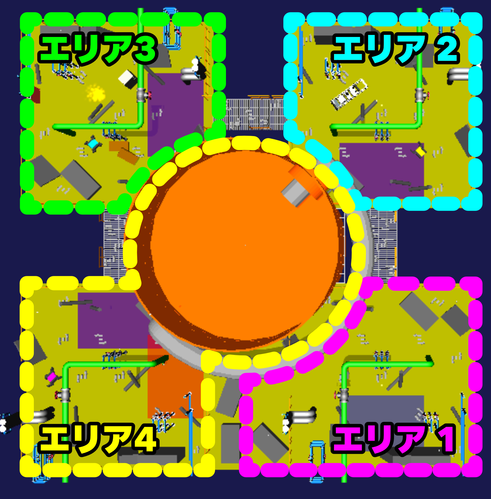

# World Robot Summit 2025 シミュレーション災害チャレンジ 2024プレ大会

## タスク概要
2024プレ大会で行う競技は，「プラント災害を想定した 過酷環境下での情報収集，緊急対応」という設定で競技を設定しました．
このような設定の下，具体的には以下の示すエリア1〜エリア4からなる4つのエリアで競技が構成しています．
競技を各エリアごとに分けて行います．



## エリア紹介

### エリア1: レバー操作


#### 内容
プラント災害後で想定される物体が散乱したエリアを探索する．エリア自体が暗くなっているため，レバーを操作することで，周辺を明るくする電灯を付けることができる．
また，周辺を把握するために，制限時間以内にエリア内に散らばっているマーカー（QRコード）読みとり，
スタート領域からゴール領域に移動を終える必要がある．
このエリアではロボットの移動能力，マニュピレーション，探索能力が試される．
さらに，遠隔操作における通信の影響で視界が悪くなることや，突如停電が起こることを想定する必要もある．

- スイッチを上げることで，電灯が付く

  
  
- エリア全域を探索し，設置されていてるQRコードを探索する

  

### エリア2, 3: バルブ操作


	


#### 内容
プラント災害後で想定される物体が散乱したエリアを探索する．エリア内にあるパイプから気体（煙），液体（水流）が漏れているため，バルブを操作することで，漏れている流体を止めることができる．
また，周辺を把握するために，制限時間以内にエリア内に散らばっているマーカー（QRコード）読みとり， スタート領域からゴール領域に移動を終える必要がある． 
このエリアではロボットの移動能力，マニュピレーション，探索能力が試される． さらに，遠隔操作における通信の影響で視界が悪くなることや，突如停電が起こることを想定する必要もある．

- バルブを回すことで，漏れている流体（煙・水流など）を止めることができる．

  
	
  

### エリア4: 消火作業，ダクト侵入，タンク内調査


#### 内容
プラント災害後で想定される物体が散乱したエリアを探索する．エリア内で火災が発生しているため，消火ホースを取り出して，火災箇所の消火を行う．
また，UAVを使用して，ダクト内を侵入し，ダクトに繋がっているタンクの調査を行う．ダクトからは気流が発生しており，バルブを操作することで気流の流れを止めることができる．
また，周辺を把握するために，制限時間以内にエリア内に散らばっているマーカー（QRコード）読みとり， スタート領域からゴール領域に移動を終える必要がある． 
このエリアではロボットの移動能力，マニュピレーション，探索能力が試される． さらに，遠隔操作における通信の影響で視界が悪くなることや，突如停電が起こることを想定する必要もある．

- 消火栓ボックスからホースを取り出し，消火を行う．

  

- ダクトから侵入し，タンク内を調査する．（気流などがある場合，バルブを先に閉める）

  

このリポジトリにはエリア1，エリア2，エリア3，エリア4の各エリアモデルを用意しております．
また，これらのエリアは練習用としてご利用できます．これらのエリアの難易度は意図的に低く設定されています．
また，各エリアにおけるタスクの遂行においては最大２台のロボットを投入し，それらを連携させることができます．

World Robot Summit 2025 シミュレーション災害チャレンジではChoreonoidをシミュレータとして使用します．
また，シミュレーションにはAGX Dynamicsを使用します．

#### 競技環境の構築方法
- https://k38-suzuki.github.io/hairo-world-plugin-doc/wrsutil/index.html

#### AGX Dynamicsインストールの参考URL
- https://choreonoid.org/ja/documents/latest/agxdynamics/install/install-agx-ubuntu.html

#### Choreonoidのインストール方法
- 前提条件
	- OSはUbuntu22.04，CPUはamd64系(Intel, Ryzen)であるとする
	- ROS2のバージョンはHumble Hawksbill 
	- AppleSiliconのMacでの仮想環境上ではインストールできない(CPUがarm系なので)
-  競技者用計算機の環境構築について
	1. Choreonoidを初めてインストールする場合（ROS2との連携無し）
	2. Choreonoidを既にインストール済みで，プレ大会の環境を追加する場合（ROS2との連携無し）
	3. Choreonoidのプレ大会向けクリーンインストール（ROS2との連携あり）

#### 1.  Choreonoidを初めてインストールする場合（ROS2との連携無し）
```bash
# Build Choreonoid Without ROS2 for 1st Time
$ cd
$ git clone https://github.com/choreonoid/choreonoid.git
$ git clone https://github.com/wrs-frei-simulation/WRS-Pre-2024.git choreonoid/ext/WRS2024PRE
$ git clone https://github.com/k38-suzuki/hairo-world-plugin.git choreonoid/ext/hairo-world-plugin
$ choreonoid/misc/script/install-requisites-ubuntu-22.04.sh
$ cd ~/choreonoid && mkdir build && cd build
$ cmake .. -DBUILD_AGX_DYNAMICS_PLUGIN=ON -DBUILD_AGX_BODYEXTENSION_PLUGIN=ON -DBUILD_WRS2018=ON -DBUILD_SCENE_EFFECTS_PLUGIN=ON -DBUILD_HAIRO_WORLD_PLUGIN=ON
$ make -j8 # CPUが8コアの場合は-j8，CPUがNコアの場合は-jN

# Run Choreonoid Without ROS2
$ ./bin/choreonoid
```

#### 2.  Choreonoidを既にインストール済みで，プレ大会の環境を追加する場合（ROS2との連携無し）

```bash
# Rebuild Choreonoid Without ROS2 For Pre-competition (Already built Choreonoid)
$ cd ~
$ git clone https://github.com/wrs-frei-simulation/WRS-Pre-2024.git choreonoid/ext/WRS2024PRE
$ git clone https://github.com/k38-suzuki/hairo-world-plugin.git choreonoid/ext/hairo-world-plugin
$ cd ~/choreonoid/build
$ cmake .. -DBUILD_AGX_DYNAMICS_PLUGIN=ON -DBUILD_AGX_BODYEXTENSION_PLUGIN=ON -DBUILD_WRS2018=ON -DBUILD_SCENE_EFFECTS_PLUGIN=ON -DBUILD_HAIRO_WORLD_PLUGIN=ON
$ make -j8 # CPUが8コアの場合は-j8，CPUがNコアの場合は-jN
```
#### 3. Choreonoidのプレ大会向けクリーンインストール（ROS2との連携あり）

1. ROS2(Humble Hawksbill)を先にインストールしておく
```Bash
# Add the ROS 2 apt repository
$ sudo apt install software-properties-common
$ sudo add-apt-repository universe
$ sudo apt update && sudo apt install curl -y
$ sudo curl -sSL https://raw.githubusercontent.com/ros/rosdistro/master/ros.key -o /usr/share/keyrings/ros-archive-keyring.gpg
$ echo "deb [arch=$(dpkg --print-architecture) signed-by=/usr/share/keyrings/ros-archive-keyring.gpg] http://packages.ros.org/ros2/ubuntu $(. /etc/os-release && echo $UBUNTU_CODENAME) main" | sudo tee /etc/apt/sources.list.d/ros2.list > /dev/null

# Install ROS 2 packages
$ sudo apt update
$ sudo apt upgrade
$ sudo apt install ros-humble-desktop
$ sudo apt install python3-colcon-common-extensions

# Sourcing the setup script (for bash)
$ echo "source /opt/ros/humble/setup.bash" >> ~/.bashrc
$ source ~/.bashrc
```

2. Choreonoidのインストールを行う
```bash
# Clean-Build Choreonoid With ROS2
$ mkdir -p ~/ros2_ws/src
$ cd ~/ros2_ws/src
$ git clone https://github.com/choreonoid/choreonoid.git
$ git clone https://github.com/choreonoid/choreonoid_ros.git
$ git clone https://github.com/choreonoid/choreonoid_ros2_mobile_robot_tutorial.git
$ git clone https://github.com/wrs-frei-simulation/WRS-Pre-2024.git choreonoid/ext/WRS2024PRE
$ git clone https://github.com/k38-suzuki/hairo-world-plugin.git choreonoid/ext/hairo-world-plugin
$ git clone https://github.com/k38-suzuki/choreonoid_ros2_sample_drone_tutorial.git
$ choreonoid/misc/script/install-requisites-ubuntu-22.04.sh
$ cd ~/ros2_ws
$ colcon build --symlink-install --cmake-args -DBUILD_AGX_DYNAMICS_PLUGIN=ON -DBUILD_AGX_BODYEXTENSION_PLUGIN=ON -DBUILD_WRS2018=ON -DBUILD_SCENE_EFFECTS_PLUGIN=ON -DBUILD_HAIRO_WORLD_PLUGIN=ON

# Run Choreonoid With ROS2
$ source install/setup.bash
$ ros2 run choreonoid_ros choreonoid
```
##### インストール関連参考URL
- Choreonoidインストール方法
	- https://choreonoid.org/ja/documents/latest/install/build-ubuntu.html
- ROS2インストール方法
	- https://docs.ros.org/en/humble/Installation/Ubuntu-Install-Debs.html#install-ros-2-packages
- ChoreonoidとROS2との連携
	- https://choreonoid.org/ja/documents/latest/ros2/install-ros2.html
##### Choreonoidチュートリアル参考URL
- Choreonoidを使う方法（ROS2連携無し）
	- https://choreonoid.org/ja/documents/latest/simulation/tank-tutorial/index.htm
	- https://k38-suzuki.github.io/hairo-world-plugin-doc/wrs/index.html
- ChoreonoidとROS2との連携
	- https://choreonoid.org/ja/documents/latest/ros2/index.html
	- https://k38-suzuki.github.io/hairo-world-plugin-doc/ros2/index.html
##### Choreonoid遠隔操作チュートリアル参考URL
- https://choreonoid.org/ja/documents/latest/wrs2018/teleoperation-ros.html
- https://k38-suzuki.github.io/hairo-world-plugin-doc/ros2/teleop.html
##### 過去のWRS関連URL
- WRS2018
	- https://choreonoid.org/ja/documents/latest/wrs2018/index.html
- WRS2020
	- https://wrs-tdrrc.github.io/
