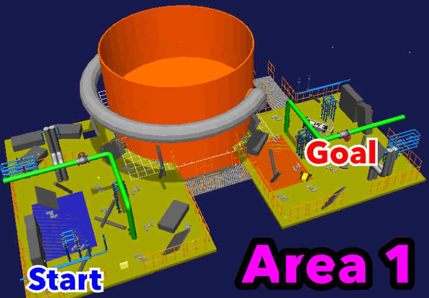
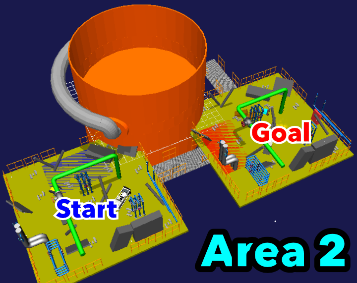
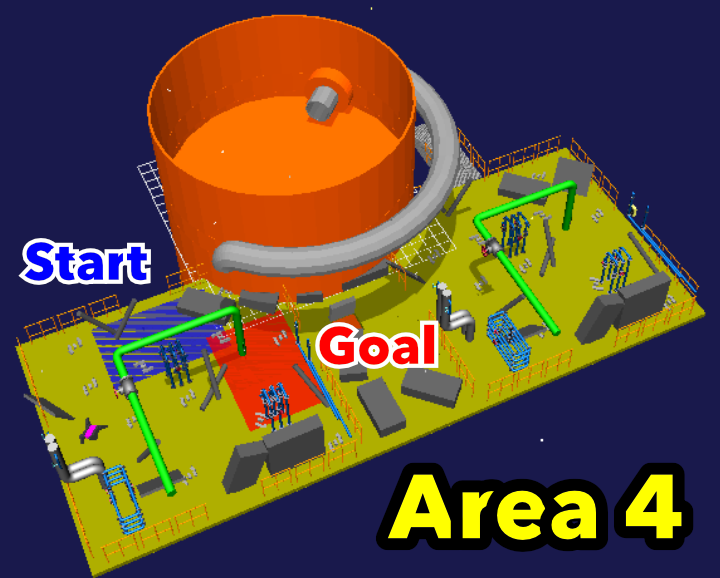

# World Robot Summit 2025 Harsh Environment F-REI Challenge, Simulation Disaster Challenge, 2024 Pre-tournament

Japanese Page（日本語ページ）: https://github.com/wrs-frei-simulation/WRS-Pre-2024/blob/main/Readme-ja.md

## Overview
The competition at the 2024 Pre-tournament was set up with the scenario of “Information gathering and emergency response in a harsh environment, assuming a plant disaster".
Under these settings, the simulation environment consisted of four areas, Area 1 to Area 4, as shown below.
The competition was divided into each area.


- Sample movie (Click on the image to view simulation on youtube)
	- Overview of the entire area

   	[](https://www.youtube.com/watch?v=Oi1t4SQqD-A)
 
	- Robot simulation

   	[](https://www.youtube.com/watch?v=b9BqyA2T81Y)

  	- Simulation of air duct intrusion affected by air flow
  
  	[](https://www.youtube.com/watch?v=iCsacqRvRAQ)  

## Live Broadcast
- Preliminary contest: https://www.youtube.com/watch?v=bKAUXahBdgg
- Final: https://www.youtube.com/watch?v=ruW7kajVFAw

## Introduction to each area

### Area 1: Lever control, Turning on the light



#### Scenario
The operator explores an area where objects are scattered after a plant disaster using robots by remote-control. 
As this area is dark, the robots can turn on lights to brighten the area by operating the switch.
In order to explore the area, you must read as many QR codes as possible, which are scattered around the area, and move the robot from the start area to the goal area within the time limit.
This area is constructed to measure the movement, manipulation and search abilities of the robots.
In addition, it is necessary to assume that the field of vision will be reduced due to the effects of communication in remote control, and that there may be sudden power outages.

- When the robot turns the switch up, the light comes on the area.

  
  
- You explore the entire area and search for the QR codes as possible. The QR codes are inside the tubes.

  

### Area 2, Area 3: Valve manipulation


	


#### Scenario
As in Area 1, you must explore an area where objects are scattered around after a plant disaster. Gases (smoke) and liquids (water) leak from pipes in the area, so the robot can stop the leaking fluids by operating the valves.
In order to explore the area, you must read as many QR codes as possible, which are scattered around the area, and move the robot from the start area to the goal area within the time limit.
This area is constructed to measure the movement, manipulation and search abilities of the robots.
In addition, it is necessary to assume that the field of vision will be reduced due to the effects of communication in remote control, and that there may be sudden power outages.

- By turning the valve, the robot can stop the leaking fluid (smoke, water, etc.).

  
	
  

### Area 4: Firefighting, entering ducts, tank inspections



#### Scenario
You must explore this area where objects are scattered after a plant disaster. Since there is a fire in the area, the robots take out a fire hose from the fire extinguisher box and put out the fire. You also use the robot, which is UAV, to enter the duct and investigate the tank connected to the duct. Airflow is generated from the duct, and the robot can stop the airflow by operating the valve.
In order to explore the area, you must read as many QR codes as possible, which are scattered around the area, and move the robot from the start area to the goal area within the time limit.
This area is constructed to measure the movement, manipulation and search abilities of the robots.
In addition, it is necessary to assume that the field of vision will be reduced due to the effects of communication in remote control, and that there may be sudden power outages.

- The robot takes out the fire hose from the fire extinguisher box and put out the fire.

  

- The UAV enters through the duct and inspects the inside of the tank. (If there is air flow, etc., the robot close the valve first.)

  

This github repository contains area models for Areas 1, 2, 3 and 4.
These areas can be used for practice. The difficulty level of these areas has been intentionally set low.
In addition, up to two robots can be deployed to carry out tasks in each area, and they can be made to work together.

Choreonoid is used as the robot simulator in the World Robot Summit 2025 Simulation Disaster Challenge.
Moreover, AGX Dynamics is used as a physics engine.

#### How to set up a simulation environment for 2024 Pre-tournament
- https://k38-suzuki.github.io/hairo-world-plugin-doc/wrsutil/index.html

#### AGX Dynamics installation reference
- https://choreonoid.org/ja/documents/latest/agxdynamics/install/install-agx-ubuntu.html

#### How to install Choreonoid
- 前提条件
	- OSはUbuntu22.04，CPUはamd64系(Intel, Ryzen)であるとする
	- ROS2のバージョンはHumble Hawksbill 
	- AppleSiliconのMacでの仮想環境上ではインストールできない(CPUがarm系なので)
-  競技者用計算機の環境構築について
	1. Choreonoidを初めてインストールする場合（ROS2との連携無し）
	2. Choreonoidを既にインストール済みで，プレ大会の環境を追加する場合（ROS2との連携無し）
	3. Choreonoidのプレ大会向けクリーンインストール（ROS2との連携あり）

#### 1.  Choreonoidを初めてインストールする場合（ROS2との連携無し）
```bash
# Build Choreonoid Without ROS2 for 1st Time
$ cd
$ git clone https://github.com/choreonoid/choreonoid.git
$ git clone https://github.com/wrs-frei-simulation/WRS-Pre-2024.git choreonoid/ext/WRS2024PRE
$ git clone https://github.com/k38-suzuki/hairo-world-plugin.git choreonoid/ext/hairo-world-plugin
$ choreonoid/misc/script/install-requisites-ubuntu-22.04.sh
$ cd ~/choreonoid && mkdir build && cd build
$ cmake .. -DBUILD_AGX_DYNAMICS_PLUGIN=ON -DBUILD_AGX_BODYEXTENSION_PLUGIN=ON -DBUILD_WRS2018=ON -DBUILD_SCENE_EFFECTS_PLUGIN=ON -DBUILD_HAIRO_WORLD_PLUGIN=ON -DENABLE_INSTALL_RPATH_USE_LINK_PATH=ON
$ make -j8 # CPUが8コアの場合は-j8，CPUがNコアの場合は-jN

# Run Choreonoid Without ROS2
$ ./bin/choreonoid
```

#### 2.  Choreonoidを既にインストール済みで，プレ大会の環境を追加する場合（ROS2との連携無し）

```bash
# Rebuild Choreonoid Without ROS2 For Pre-competition (Already built Choreonoid)
$ cd ~
$ git clone https://github.com/wrs-frei-simulation/WRS-Pre-2024.git choreonoid/ext/WRS2024PRE
$ git clone https://github.com/k38-suzuki/hairo-world-plugin.git choreonoid/ext/hairo-world-plugin
$ cd ~/choreonoid/build
$ cmake .. -DBUILD_AGX_DYNAMICS_PLUGIN=ON -DBUILD_AGX_BODYEXTENSION_PLUGIN=ON -DBUILD_WRS2018=ON -DBUILD_SCENE_EFFECTS_PLUGIN=ON -DBUILD_HAIRO_WORLD_PLUGIN=ON -DENABLE_INSTALL_RPATH_USE_LINK_PATH=ON
$ make -j8 # CPUが8コアの場合は-j8，CPUがNコアの場合は-jN
```
#### 3. Choreonoidのプレ大会向けクリーンインストール（ROS2との連携あり）

1. ROS2(Humble Hawksbill)を先にインストールしておく
```Bash
# Add the ROS 2 apt repository
$ sudo apt install software-properties-common
$ sudo add-apt-repository universe
$ sudo apt update && sudo apt install curl -y
$ sudo curl -sSL https://raw.githubusercontent.com/ros/rosdistro/master/ros.key -o /usr/share/keyrings/ros-archive-keyring.gpg
$ echo "deb [arch=$(dpkg --print-architecture) signed-by=/usr/share/keyrings/ros-archive-keyring.gpg] http://packages.ros.org/ros2/ubuntu $(. /etc/os-release && echo $UBUNTU_CODENAME) main" | sudo tee /etc/apt/sources.list.d/ros2.list > /dev/null

# Install ROS 2 packages
$ sudo apt update
$ sudo apt upgrade
$ sudo apt install ros-humble-desktop
$ sudo apt install ros-humble-compressed-image-transport
$ sudo apt install python3-colcon-common-extensions

# Sourcing the setup script (for bash)
$ echo "source /opt/ros/humble/setup.bash" >> ~/.bashrc
$ source ~/.bashrc
```

2. Choreonoidのインストールを行う
```bash
# Clean-Build Choreonoid With ROS2
$ mkdir -p ~/ros2_ws/src
$ cd ~/ros2_ws/src
$ git clone https://github.com/choreonoid/choreonoid.git
$ git clone https://github.com/choreonoid/choreonoid_ros.git
$ git clone https://github.com/choreonoid/choreonoid_ros2_mobile_robot_tutorial.git
$ git clone https://github.com/wrs-frei-simulation/WRS-Pre-2024.git choreonoid/ext/WRS2024PRE
$ git clone https://github.com/k38-suzuki/hairo-world-plugin.git choreonoid/ext/hairo-world-plugin
$ git clone https://github.com/k38-suzuki/choreonoid_ros2_sample_drone_tutorial.git
$ choreonoid/misc/script/install-requisites-ubuntu-22.04.sh
$ cd ~/ros2_ws
$ colcon build --symlink-install --cmake-args -DBUILD_AGX_DYNAMICS_PLUGIN=ON -DBUILD_AGX_BODYEXTENSION_PLUGIN=ON -DBUILD_WRS2018=ON -DBUILD_SCENE_EFFECTS_PLUGIN=ON -DBUILD_HAIRO_WORLD_PLUGIN=ON -DENABLE_INSTALL_RPATH_USE_LINK_PATH=ON

# Run Choreonoid With ROS2
$ source install/setup.bash
$ ros2 run choreonoid_ros choreonoid
```

##### Course Used for the Pre-Tournament
- https://github.com/wrs-frei-simulation/WRS-Pre-2024/tags
	- 1003: The complete set of simulation course model for the preliminary contest used in the morning of 10/04
	- 1004: The complete set of simulation course model for the preliminary contest used in the afternoon of 10/04
	- 1005: The complete set of simulation course model for the final used on 10/05

##### Reference URLs for installation
- How to install Choreonoid
	- https://choreonoid.org/ja/documents/latest/install/build-ubuntu.html
- How to install ROS2
	- https://docs.ros.org/en/humble/Installation/Ubuntu-Install-Debs.html#install-ros-2-packages
- Integration for Choreonoid and ROS2 
	- https://choreonoid.org/ja/documents/latest/ros2/install-ros2.html
##### Choreonoid Tutorial Reference URL
- How to use Choreonoid (without ROS2)
	- https://choreonoid.org/ja/documents/latest/simulation/tank-tutorial/index.htm
	- https://k38-suzuki.github.io/hairo-world-plugin-doc/wrs/index.html
- How to use Choreonoid (with ROS2)
	- https://choreonoid.org/ja/documents/latest/ros2/index.html
 	- https://github.com/choreonoid/choreonoid_ros2_mobile_robot_tutorial/blob/main/doc/ros2_mobile_robot_tutorial_ja.pdf 
	- https://k38-suzuki.github.io/hairo-world-plugin-doc/ros2/index.html
##### Choreonoid Remote Control Tutorial Reference URLs
- https://choreonoid.org/ja/documents/latest/wrs2018/teleoperation-ros.html
- https://k38-suzuki.github.io/hairo-world-plugin-doc/ros2/teleop.html
##### Past WRS-related URLs
- WRS2018
	- https://choreonoid.org/ja/documents/latest/wrs2018/index.html
- WRS2020
	- https://wrs-tdrrc.github.io/
